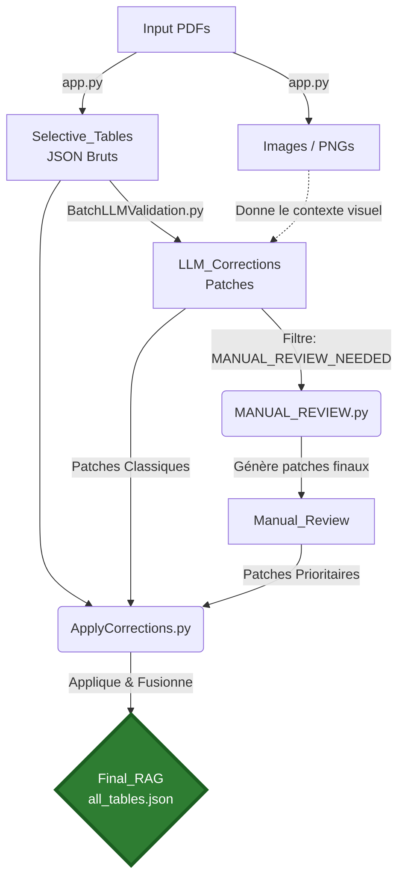

# 🚀 Pipeline A to Z — Extraction, Validation & Correction

Ce document décrit le cheminement complet des données, de l'extraction initiale des PDF jusqu'au fichier final agrégé pour le RAG.

---

## 📄 Phase 1 : Extraction Brute (PDF → JSON)
Le point de départ du pipeline. On prend les PDF originaux de STMicroelectronics et on extrait intelligemment tous les tableaux grâce à `pdfplumber` et des heuristiques personnalisées.

- **📥 INPUT :**
  - Fichiers PDF originaux : `Input/PDFs/<family>/*.pdf`
- **⚙️ SCRIPT :** `app.py` *(qui utilise le moteur dans `table_extractor_raw/`)*
- **📤 OUTPUT :**
  - Fichiers JSON structurés bruts : `Output/Json/Selective_Tables/<family>/<datasheet>/*.json`
  - Images PNG des pages (pour le LLM plus tard) : `Output/Images/Tables_Screenshots/<family>/<datasheet>/*`
- **💻 COMMANDES POSSIBLES :**
  ```powershell
  # Traiter une famille entière (ex: Famille 41)
  python app.py --family 41
  
  # Traiter un PDF spécifique (ex: stm32c011d6)
  python app.py --pdf Input/PDFs/C0/stm32c011d6.pdf
  
  # Tout traiter
  python app.py --all
  ```

---

## 🤖 Phase 2 : Validation & Correction par le LLM
Le LLM analyse les tables extraites (JSON + Image de la page) pour détecter et patcher les erreurs de l'extracteur (décalages, texte inversé, en-têtes manquants, lignes inutiles liées aux sauts de page).

- **📥 INPUT :**
  - Fichiers JSON bruts : `Output/Json/Selective_Tables/<family>/<datasheet>/*.json`
  - Images PNG de la page correspondante : `Output/Images/Tables_Screenshots/<family>/<datasheet>/*`
- **⚙️ SCRIPT :** `BatchLLMValidation.py`
- **📤 OUTPUT :**
  - Fichiers de correction (patches JSON) : `Output/Json/LLM_Corrections/<family>/<datasheet>/*.json`
- **💻 COMMANDES POSSIBLES :**
  ```powershell
  # Traiter une famille entière avec 3 workers
  python PipelineViaLLM\BatchLLMValidation.py --an 41 --workers 3
  
  # Traiter un datasheet spécifique avec 2 workers
  python PipelineViaLLM\BatchLLMValidation.py --datasheet stm32c011d6 --workers 2
  ```
  *(Le script gère automatiquement les pools d'API et les limites de requêtes)*

---

## 🧐 Phase 3 : Revue Manuelle Automatisée (Cas complexes)
Le LLM effectue une deuxième passe **uniquement** sur les tables qui ont été flaggées en `MANUAL_REVIEW_NEEDED` lors de la Phase 2 (car trop complexes pour une correction automatique à la volée).

- **📥 INPUT :**
  - Fichiers nécessitant une revue : `Output/Json/LLM_Corrections/<family>/<datasheet>/*.json`
  - Fichiers JSON bruts : `Output/Json/Selective_Tables/<family>/<datasheet>/*.json`
- **⚙️ SCRIPT :** `MANUAL_REVIEW.py`
- **📤 OUTPUT :**
  - Corrections définitives (patches JSON) pour ces cas difficiles : `Output/Json/Manual_Review/<family>/<datasheet>/*.json`
- **💻 COMMANDES POSSIBLES :**
  ```powershell
  # Traiter les erreurs d'une famille entière
  python PipelineViaLLM\MANUAL_REVIEW.py --family 41 --workers 3
  
  # Traiter les erreurs d'un datasheet spécifique
  python PipelineViaLLM\MANUAL_REVIEW.py --pdf stm32c011d6 --workers 3
  ```

---

## ✨ Phase 4 : Application des Corrections & Agrégation Finale (Pour le RAG)
Le script applique les corrections sur les tables brutes d'origine et fusionne l'intégralité du document en un seul et unique fichier parfait, prêt à être ingéré par le RAG.

- **📥 INPUT :**
  - 1️⃣ *Priorité 1 :* `Output/Json/Manual_Review/<family>/<datasheet>/*.json`
  - 2️⃣ *Priorité 2 :* `Output/Json/LLM_Corrections/<family>/<datasheet>/*.json`
  - 3️⃣ *Source :* `Output/Json/Selective_Tables/<family>/<datasheet>/*.json`
- **⚙️ SCRIPT :** `ApplyCorrections.py`
- **📤 OUTPUT :**
  - Tables corrigées individuelles + **Le gros fichier final pour le RAG (`DSxxxx_all_tables.json`)** : `Output/Json/Final_RAG/<family>/<datasheet>/`
- **💻 COMMANDES POSSIBLES :**
  ```powershell
  # Appliquer sur une famille entière (et regrouper par datasheet)
  python PipelineViaLLM\ApplyCorrections.py --family 41 --workers 6
  
  # Appliquer sur un datasheet spécifique
  python PipelineViaLLM\ApplyCorrections.py --family 41 --datasheet stm32c011d6 --workers 6
  ```

---

## 🗺️ Résumé Visuel du Cheminement (De A à Z)


